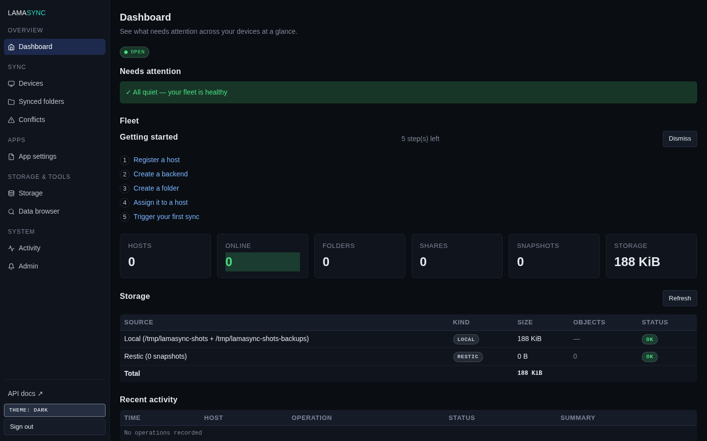

# LamaSync

**Your personal sync-fleet controller.** One small server keeps your folders,
backups, and app settings in sync across every device you own — orchestrated
through **rclone** over your own tailnet.

```
 LXC / Docker server          Laptop                    Desktop
 ┌──────────────┐         ┌──────────────┐          ┌──────────────┐
 │ lamasync-    │◄──REST──┤ lamasyncd    │          │ lamasyncd    │
 │ server       │◄──WS────┤  (daemon)    │◄─────────┤  (daemon)    │
 │ SQLite       │         │ lamasync-tui │          │ lamasync-tui │
 │ rclone       │◄──rclone│  (TUI + CLI) │          │  (TUI + CLI) │
 └──────────────┘         └──────────────┘          └──────────────┘
```

The server is the control plane: it holds your folder definitions, schedules,
and a generated rclone config per device, and it records every sync/backup
operation. Each device runs a lightweight daemon that does the actual file
work and reports back. The terminal UI (`lamasync-tui`) is a fast local
cockpit; the web UI is the fleet control plane; a scriptable CLI rides on the
same binary.

## What does this do for me?



- **Folders that stay in sync everywhere** — pick a folder, decide how it
  syncs (two-way, one-way backup, read-only mount), and the fleet keeps it
  that way. Per-folder conflict strategies ("keep newest", "prefer this
  device", "keep both", "ask me") take the guesswork out of collisions.
- **Backups with a heartbeat** — backup-type folders push data to your
  storage destination on a schedule you set in plain language (hourly, daily,
  on boot). You see every run in the Activity view.
- **App settings that survive reinstalls** — protect named configuration paths
  for nvim, your shell, editor settings, and more; inspect or download an
  immutable snapshot when setting up a new device. Guided target-side restore
  is the next safety-focused step.
- **One web/terminal view of the whole fleet** — devices, storage
  destinations, pending conflicts, recent activity: everything in one place,
  reachable from a browser or an SSH terminal.
- **Self-hosted and tailnet-only** — no cloud account, no third-party sync
  service. Your data travels over your own Tailscale network, and the API is
  protected by a break-glass master key plus managed admin/device credentials.

## Features

- **Folder types**: `sync` (two-way, `rclone bisync`), `backup` (one-way
  `rclone copy`), `mount` (read-only remote mount, VFS-cached), and `git`
  (repo sync without re-cloning). App settings use separate templates,
  per-device protections, and immutable snapshots.
- **Reusable storage destinations** — SFTP, S3, local/NFS paths, and restic
  repos, referenced by any number of folders.
- **Conflict strategies** per folder, in plain language.
- **Schedules** your way: hourly/6-hourly/daily/weekly/monthly presets, on
  boot, on login, or a custom cron expression.
- **`.lamasyncignore`** per-folder exclude patterns (plus a mount variant).
- **Pre/post hooks** — shell scripts that run around each sync.
- **Versioned app settings backups** with host-bound protections, schedules,
  snapshot history, inspection, and download.
- **Live WebSocket** for operation events (the Activity view updates as runs
  finish).
- **Terminal UI + CLI in one binary** — task-oriented tabs (This device, All
  devices, Backups & apps, Conflicts, Activity, More) and a non-interactive
  `lamasync <command>` CLI for scripting and agents, with stable exit codes
  and `--json` everywhere.
- **Web management UI** — grouped navigation, responsive down to phones.
- **Hardened systemd user service** on clients and a **one-line install**.
- **Self-update** from GitHub Releases (`lamasyncd --update`, or the install
  script keeps the agent-skill bundle in lockstep with the binary).
- **CI/CD** — tests, builds, releases, and Docker image publishing on every
  push to `master`.


## 15-minute setup

### What you need

- A machine to run the server on — any always-on box with Docker (or just a
  Linux host with [Bun](https://bun.sh)) works. The reference deployment is a
  small LXC container on a Proxmox host.
- [rclone](https://rclone.org/install/) available to the server (and to every
  device you want to sync).
- A tailnet ([Tailscale](https://tailscale.com/), Headscale, …) so all your
  devices can reach the server by a stable address.
- One pre-shared API key you generate — that's the whole auth model.

### 1. Start the server

```bash
git clone https://github.com/aliforfaen/LamaSync.git
cd LamaSync
cp docker/.env.example docker/.env
$EDITOR docker/.env        # set LAMASYNC_API_KEY to a long random string
docker compose -f docker/docker-compose.yml --env-file docker/.env up -d
```

Verify it answers (use your server's tailnet address):

```bash
curl -H "Authorization: Bearer $LAMASYNC_API_KEY" http://<server-tailnet-ip>:8080/api/v1/health
# → {"status":"ok","hostCount":0,"onlineCount":0,"hosts":[]}
```

The web UI is at `http://<server-tailnet-ip>:8080/`, Swagger at
`/swagger`. Production/tailnet-specific operations (updates, Docker
details, SSH) are documented in `docs/prod-deploy.md` — this README stays
public-safe.

### 2. Install the daemon on each device

```bash
curl -sSL https://raw.githubusercontent.com/aliforfaen/LamaSync/master/packaging/install/install.sh | \
  bash -s -- --server-url http://<server-tailnet-ip>:8080 \
             --api-key "$LAMASYNC_API_KEY" \
             --with-tui
```

This downloads `lamasyncd` (+ the terminal UI with `--with-tui`), writes
`~/.config/lamasync/client.toml` (mode 600), installs the systemd **user**
service, and starts it.

> The install script pulls binaries from the latest GitHub Release. If a
> release has not been published for the current checkout yet, build from
> source (see [Development](#development)) and copy
> `packages/daemon/dist/lamasyncd` / `packages/tui/dist/lamasync-tui` to
> `~/.local/bin/` yourself.

Check it's alive:

```bash
systemctl --user status lamasyncd
journalctl --user -u lamasyncd -f
```

### 3. Point a folder at your fleet

- **Web UI** — log in with the API key, open **Synced folders** → new folder,
  pick the type, choose a storage destination, and set it up on a device.
- **TUI** — tab to **This device**, press `w` for a guided new-backup wizard.
- **CLI** — scriptable, same thing:

```bash
lamasync-tui folders create --name LamaFiles --type sync
lamasync-tui folders assign LamaFiles --host <device-id> --path /home/you/LamaFiles
```

(Any subcommand after `lamasync-tui` runs the CLI; bare `lamasync-tui` on a
TTY boots the terminal UI. On an installed client, tab to **Backups & apps**
to see fleet-wide backup folders + restore app settings, and **More** for
GitHub repo adoption.)

Within one daemon config refresh (≤5 min), the device picks up the folder and
starts syncing on schedule. Watch it happen in the **Activity** view.

## Architecture

| Component | Purpose |
|-----------|---------|
| `lamasync-server` | REST + WebSocket + SQLite + embedded React web UI. Owns folder definitions, schedules, per-device generated rclone configs, and the operation log. |
| `lamasyncd` | One per device (systemd user service). Runs the scheduled rclone operations, mounts, hooks, and ignore patterns; exposes a Unix socket for the local TUI. |
| `lamasync-tui` | Terminal UI **and** CLI in one binary. Local mode talks to the daemon over its socket; fleet mode talks to the server; any positional command is a headless CLI (stable exit codes, `--json`). |

The terminal UI (task-oriented tabs, 80-column-friendly):

```
 This device  All devices  Backups      Conflicts    Activity     More
▬▬▬▬▬▬▬▬▬▬▬▬▬

┌──────────────────────────────────────────────────────────────────────────────┐
│ Backups & apps                                                               │
│ Backup folders (3)                                                           │
│   appdata-backups — sftp                                                     │
│   home-snapshots — sftp                                                      │
│   photos-archive — sftp                                                      │
│                                                                              │
│ App settings — protection snapshots                                           │
│ Select an app to inspect or download its snapshots.                           │
└──────────────────────────────────────────────────────────────────────────────┘
```

(More captures: `docs/lama275-artifacts/`.)

### How a sync happens

1. A device registers itself (`POST /api/v1/register`) and reports health on a
   heartbeat.
2. The daemon pulls its config (`GET /api/v1/config/:deviceId`) — folder
   assignments with schedules/hooks/conflict strategy, enabled app protections,
   and a generated rclone config fragment. A `config_revision`
   bump makes devices re-pull immediately instead of waiting for the 5-minute
   timer.
3. The scheduler fires (cron preset, custom expression, `@reboot`, or
   `@login`), the executor builds the rclone command per folder type, honors
   hooks and ignore files, and streams a JSON log back for real transfer
   counts.
4. Every run lands in the operation log and broadcasts over WebSocket to the
   TUI/web Activity views (and to your notification channels, if configured).

### Storage destinations

`rclone` is the file engine — the server generates a small per-operation
rclone config. Today the built-in destination kinds are **SFTP**, **S3**,
**local/NFS server paths**, and **restic** repositories; because everything is
an rclone remote under the hood, other backends slot in the same way.

## Development

```bash
bun install
bun x tsc --noEmit        # type check — always green before committing
bun run build:web-ui      # needed before bun test (server test imports dist/index.html)
bun test
bun run build             # → standalone binaries in packages/*/dist/
```

Dev servers (`dev:server` / `dev:daemon` / `dev:tui` / `dev:web-ui`), the
E2E harness (`scripts/e2e-harness.sh`), and the installer/updater smoke
tests (`scripts/test-install.sh`, `scripts/test-update.sh`) are described in
`docs/development.md`. The repo layout, design notes, and the rolling status
log live in `docs/` — `docs/agent-start.md` is the entry point for agents.

## License

MIT
