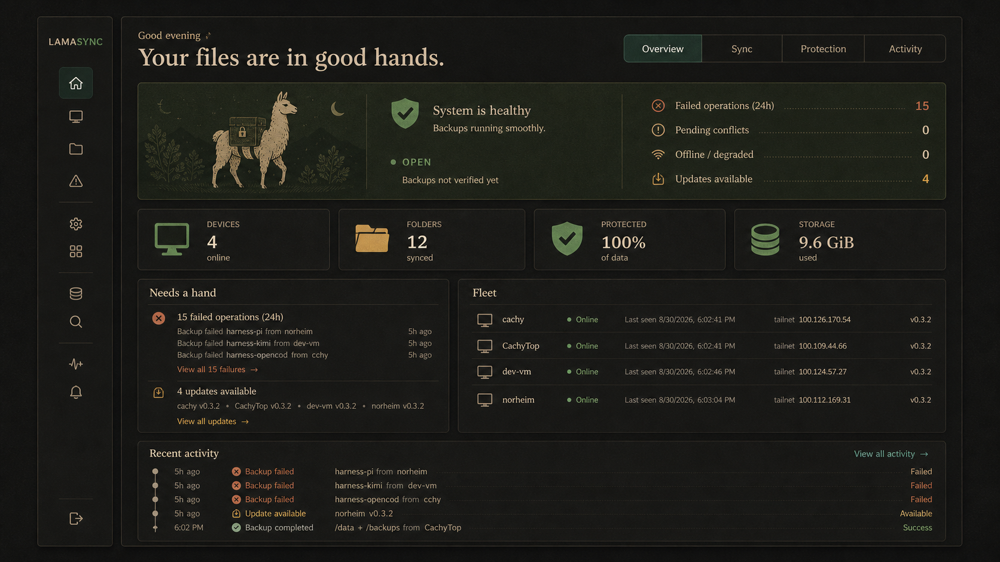

# Cozy dashboard & Lama visual identity

> **Status:** approved design direction, implementation handoff  
> **Related:** LAMA-275 — design system + web/TUI shell overhaul (completed)  
> **Companion issue:** LAMA-295 — Cozy dashboard and Lama visual identity

The image above is a visual concept, not a pixel-perfect specification. It
captures the intended hierarchy, atmosphere, and restraint; live data,
interactions, accessibility, and existing LamaSync conventions remain the
source of truth.

## Product intent

LamaSync should feel like a quiet, dependable home for a personal sync fleet:
competent and technically honest, but never an impersonal operations console.
The product's first question is not “what data do we have?” but “are my files
safe, in step, and recoverable?”

The visual register is a **cozy nocturnal workshop**: graphite and espresso
surfaces, warm text, moss-green healthy states, clay/rust attention states,
and teal only for selection or direct interaction. Use visual warmth through
spacing, typography, texture, and hierarchy—not decorative noise.

## Information architecture

Present the product around a person's responsibilities rather than database
terms. Keep the approved LAMA-275 left rail and responsive drawer; refine its
language and page purpose around these homes:

| Home | Primary question | Includes |
| --- | --- | --- |
| **Overview** | Is everything okay? | health, attention, concise activity |
| **Sync** | Are working files in step? | Devices, Synced folders, Conflicts |
| **Protection** | Can I recover my data? | Backups, Storage destinations, snapshots, verification |
| **Apps** | Are app settings safe? | App settings backups, App presets |
| **Activity** | What changed? | filterable fleet history |

Administration, API docs, theme controls, and sign-out remain subordinate rail
utilities. Existing routes, storage concepts, and configuration stay intact;
this is presentation and wayfinding, not a data-model rewrite.

Use the terminology established in `docs/terminology.md`: **Device**, **Synced
folder**, **Storage destination**, **App settings backup**, and **Activity**.
Never lead user-facing copy with “host”, “backend”, “assignment”, or “daemon”.

## First-run and ongoing care

New users should begin with an outcome, not a configuration vocabulary lesson.
The first-run surface offers four concise choices:

- **Keep a folder in sync** — choose the folder and the Devices that should
  share it.
- **Protect a folder with backups** — choose what to protect, a Storage
  destination, and a schedule.
- **Protect an app's settings** — choose an app preset or app settings backup
  and the Devices it applies to.
- **Connect another Device** — pair the next machine and verify it has joined
  the fleet.

Each completed flow ends with a human sentence describing the result and the
next scheduled or expected event. Advanced fields, raw schedules, paths, and
transport details remain available, but only after the primary choice is
understood.

Installation and updates belong in this care model. Provide one canonical,
plain-language “Install LamaSync” and “Keep LamaSync updated” path in the
onboarding and Device context, with copyable commands and a verification step.
The web UI should show each Device's installed version and update availability;
when supported by the existing daemon update mechanism, it offers a deliberate
**Update this Device** action with release context, progress, result, and a
safe retry path. Do not introduce an unreviewed one-click whole-fleet update.
If the existing API cannot safely express a per-Device update request, define
the smallest authenticated, device-scoped request/response contract before
building the control; it must report pending, running, succeeded, failed, and
unreachable states without exposing secrets.

## Dashboard composition

The Dashboard is a fixed, centered desktop composition (about 1080px maximum
content width), with comfortable gutters. It must tell one true status story
before revealing detail.

1. **Context and local tabs.** A short time-aware greeting and plain-language
   headline sit above `Overview · Sync · Protection · Activity`. These tabs
   filter the Dashboard's lens; the rail remains global navigation.
2. **Conditional health hero.** One wide panel carries the fleet verdict,
   explanation, and next action. Its wording must match the actual condition:
   “Your files are in good hands” only when no important attention state is
   present; otherwise use a clear attention-first verdict such as “Your files
   need a hand.” Backup completion and backup verification are separate facts.
3. **Four signal tiles.** Devices, Synced folders, Protection/verification,
   and Storage are compact, icon-led, and explanatory. Replace surplus
   statistics with contextual detail on the relevant tab or page.
4. **A balanced working area.** “Needs a hand” is a short actionable list,
   not four equally weighted alert cards. Pair it with a compact Fleet roster
   showing device availability and recent check-in information.
5. **Activity ledger.** A short timeline-style ledger finishes the page.
   It is scannable, links to the full Activity page, and distinguishes
   success, deferred work, warnings, and failures by icon + text + color.

On narrow screens, stack the hero content and signal tiles; preserve action
labels, never rely on horizontal page scrolling, and use the existing drawer
navigation behavior.

## Visual and interaction language

### Layout and type

- Prefer generous negative space, fine rules, and restrained 8–10px corners
  over a field of large floating cards.
- Use a softly editorial display face for headings only; UI labels and data
  use a humanist sans. Keep monospace for paths, IDs, timestamps, commands,
  and raw output.
- Give each page one clear primary action. Technical detail belongs in an
  inset or progressive disclosure rather than the opening view.

### Status and explanations

- Status always combines a familiar icon, plain-language label, and color.
- Every managed item gets a one-sentence purpose. For example: “Keeps
  `Projects` identical across CachyTop and dev-vm,” or “Keeps encrypted
  recovery copies in Local storage.”
- Surface “Verified” separately from “Completed”; a copy succeeding does not
  prove recovery works.
- Preserve keyboard focus, reduced motion, dark/light parity, and existing
  accessible labels.

### Service and object icons

Use clear non-llama icons to make functions and behaviours legible before the
user learns the words. The reference study is
`packages/web-ui/src/assets/design-studies/service-icon-study.png`.

| Concept | Icon meaning |
| --- | --- |
| Object storage | S3-compatible destination |
| Network storage | NFS or shared-network destination |
| Local storage | directly attached destination |
| Protected folder | recoverable backup coverage |
| Synced folder | active cross-Device synchronization |

Final icons are individual, accessible SVG components in one filled app-icon
family, not generated raster UI assets. Pair every icon with its label; no
storage type, protection state, or folder behaviour may be communicated by
icon or color alone.

### Alerts, activity, and recovery

- Group repeated instances of the same underlying failure into one alert with
  a count, affected Devices/items, first/most-recent occurrence, and a direct
  next action. Do not flood the Dashboard or Activity list with duplicates.
- Let people filter Activity and alerts by scope (Device, Synced folder,
  Backup/App settings backup), status, time range, and whether the item still
  needs attention. Keep the default view concise and current.
- Give recovery a named, guided path from Protection and from any failed
  backup: choose the protected item, select a recovery point, choose a safe
  destination, review impact, then start and follow the restore. Explain the
  difference between inspecting, restoring elsewhere, and replacing files.
- A Device and a Synced folder each have a dedicated home page. Their first
  viewport states purpose, health, relationships, last useful activity, and
  one likely next action; detailed configuration and machine-shaped facts are
  progressively disclosed.

### Lama visual identity

The llama is a small sign of care, not the interface's main subject.

- **Primary brand mark (48px and up):** use the pack llama: a steady,
  forward-moving silhouette with a rounded field pack, flap, buckle, and
  shoulder strap. Its four transparent PNG variants live in
  [`packages/web-ui/src/assets/brand/`](../packages/web-ui/src/assets/brand/).
  Use black or light teal on the warm light theme; use white or dark moss on
  the dark theme. It belongs in an application masthead, onboarding, release
  material, and future app identity—not in every dashboard card. The web
  navigation implements this as the shared `BrandLockup` component: dark moss
  and light teal switch with the theme, while the `LamaSync` title stays live
  code text beside the decorative image.
- **Small UI icons (16–32px):** use filled, single-colour SVG silhouettes.
  Preserve one identifying gesture only—walking with sync arrows, drifting
  with an umbrella, or sitting beside a document. Avoid fur texture, thin
  stroke dependencies, complex facial detail, gradients, and emoji styling.
- **Illustrations (empty/loading/error states):** use the more expressive
  line-art family sparingly. Good moments include a llama floating away under
  an umbrella during an empty or loading state, and a dignified harmless slip
  for a recoverable error state. Source concepts live in
  `packages/web-ui/src/assets/llamas/`; see that directory's README before
  adopting them.
- **Ordinary product surfaces:** do not add llamas to data cards, navigation
  labels, or every success message. One quiet hero or empty-state treatment is
  enough.
- Keep the small icon family hand-authored as SVG components using
  `currentColor`; the generated pack mark is deliberately a larger raster
  brand asset, not the source of the application icon system.
- For future favicons, PWA, desktop, or mobile application icons, create
  square exports from the source mark and test them at their actual target
  sizes. Do not reuse the 4:3 presentation PNGs directly at tiny sizes; the
  asset README records the clear-space and accessibility rules.

## Implementation work packages

1. **Design foundations** — add the warm theme tokens, typography roles,
   semantic status treatments, filled icon rules, and dark/light counterparts
   without changing routes, API shapes, schema, CLI commands, or daemon
   behavior.
2. **Wayfinding and explanations** — retain the LAMA-275 rail structure,
   introduce the Protection framing where appropriate, and add concise
   purpose copy to user-managed items.
3. **Dashboard recomposition** — implement the fixed-width hero, local tabs,
   signal tiles, attention list, fleet roster, and activity ledger from this
   brief. The hero must derive its state from existing data and remain
   truthful when errors, offline devices, conflicts, or missing verification
   exist.
4. **Guided care flows** — introduce outcome-led first-run choices, canonical
   install/update guidance, per-Device update status and safe remote update
   action, deduplicated/filterable alerts, and recovery guidance. Reuse the
   current daemon update path where possible; isolate any required new API
   contract to this explicit feature work.
5. **Object home pages** — recompose Device and Synced folder detail pages as
   relationship-and-health homes with progressive disclosure, then link their
   scoped activity, protection, and recovery paths.
6. **Icon and Lama asset set** — draw the filled service icon family and the
   minimal llama SVG family; add only the approved supporting illustrations.
   Respect `prefers-reduced-motion` for any loader animation.
7. **Quality sweep** — verify responsive layouts at 360px, 768px, and 1440px;
   inspect dark and light themes; keyboard-test tabs, controls, focus, and
   loading/error states; capture before/after artifacts.

## Acceptance checklist

- The Dashboard has one unambiguous fleet verdict and never claims health
  while important attention items exist.
- The first viewport makes the next action, device/folder protection state,
  and recent change easy to understand without scanning every metric.
- Sync, Protection, and Apps use plain-language explanations while preserving
  existing behavior and routes.
- Filled llama icons remain identifiable at 16px and work in both themes;
  illustrations stay occasional and subordinate.
- The service icon family distinguishes object/network/local storage and
  sync/protection semantics while retaining text labels and theme parity.
- First-run, installation, and updates are understandable without internal
  vocabulary; per-Device updates are explicit, observable, and never an
  accidental fleet-wide action.
- Repeated alerts are grouped, filterable, and actionable; recovery has a
  guided, plain-language route.
- Device and Synced folder pages explain their role, health, relationships,
  activity, and next action before exposing technical detail.
- Existing public API, CLI, config, database, and daemon contracts remain
  unchanged except for the smallest approved device-scoped update contract if
  the existing update path cannot support the web action.
- `bun x tsc --noEmit`, `bun run build:web-ui`, and `bun test` pass; update
  screenshots or visual artifacts demonstrate the supported breakpoints.
